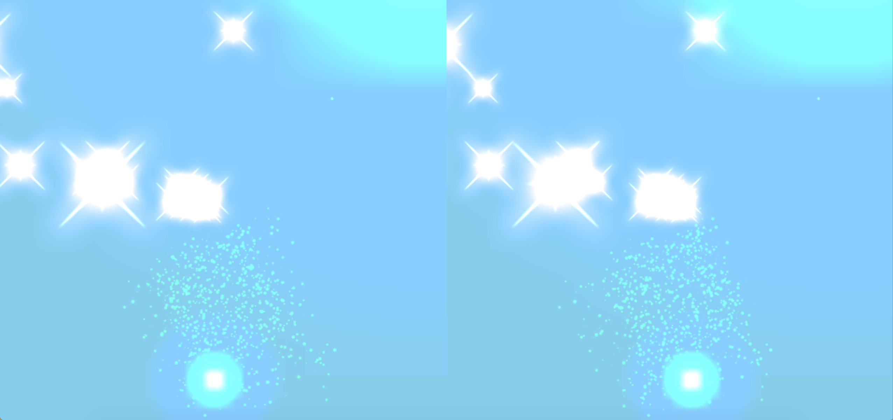

#Google Cardboard Javascript Browser App
#### Sheridan IMM: Tech Studio Term 2 Project
#### Repo: googleCardboard_techstudio_term2

####Contributors: Caitlin Haaf, Jermain Joseph, Lucey Kim
******
The Goal: To create an abstract, animated 3D portable VR experience.

We used 3 different types of particles in our project,  that we will refer to using the following:
* Particle system (animated grouping of particles)
* Rotating "sparkle" sprites
* Shooting central particles  



******

JS Library: [three.js](https://github.com/mrdoob/three.js/)

All the effects/contollers etc. used were pulled from the [three.js library examples](https://github.com/mrdoob/three.js/tree/master/examples)  
* Effects and Systems: 
  + [Stereo effect](https://github.com/mrdoob/three.js/blob/master/examples/webgl_effects_stereo.html) - splits the screen in half and duplicates the image.
  + [GPU Particle System](https://github.com/mrdoob/three.js/blob/master/examples/webgl_gpu_particle_system.html) - allows for the generation/manipulation/destruction of particle systems
* Renderers:
  + [Canvas Renderer](https://github.com/mrdoob/three.js/blob/master/examples/js/renderers/CanvasRenderer.js)
  + [Projector Renderer](https://github.com/mrdoob/three.js/blob/master/examples/js/renderers/Projector.js)
* Controls:
  + [Device Orientation Controls](https://github.com/mrdoob/three.js/blob/master/examples/js/controls/DeviceOrientationControls.js)
  + [Orbit Controls](https://github.com/mrdoob/three.js/blob/master/examples/js/controls/OrbitControls.js)

Firstly, in the body of our index.html document, create a div that will act as a container for our project.
```{r}
<div id="webglviewer"></div>
```
Then style this div so that it takes up the entire device screen/ browser window 
```{r}
body {
        margin: 0;
        overflow: hidden;
      }
#webglviewer {
        bottom: 0;
        left: 0;
        position: absolute;
        right: 0;
        top: 0;
      }	
```
Be sure to link to all of the neccessary modules/libraries etc. (links above)
```r
    <!-- EFFECTS/LIBRARIES  -->
    <script src="js/three.min.js"></script>
    <script src="js/StereoEffect.js"></script>
    <script src="js/GPUParticleSystem.js" charset="utf-8"></script>
    <script src="js/stats.min.js"></script>
    <script src="js/tween.min.js"></script>

    <!-- THREE JS CONTROLS  -->
    <script src="js/controls/DeviceOrientationControls.js"></script>
    <script src="js/controls/OrbitControls.js"></script>

    <!-- RENDERERS -->
    <script src="js/renderers/Projector.js"></script>
    <script src="js/renderers/CanvasRenderer.js"></script>
```

Set up the variables you will need to set up the camera, animations, particle systems, etc. 
```{r}
    //CAMERA/SETUP VARIABLES
    //------------------------------
    var scene,
        camera,
        renderer,
        element,
        container,
        effect,
        controls,
        clock = new THREE.Clock(true),

    //PARTICLE SYSTEM VARIABLES
    //------------------------------
    tick = 0,
    options1,
    options2,
    spawnerOptions,
		particleSystem1,
    particleSystem2,
    effect,

    //PARTICLE VARIABLES
    //------------------------------
    particles = new THREE.Object3D(),
    totalParticles = 30,
    maxParticleSize = 80,
    particleRotationSpeed = .1,
    particleRotationDeg = 5,
    lastColorRange = [0, 5],
    currentColorRange = [0, 0.3];
    
    init()
```
######INIT FUNCTION
Once we've set up our necessary variables, we run an init function to set up our scene. You will want to create a new three.js scene, camera (to be added to/positioned within the scene), renderer (to be applied to the #webglviewer div), stereo effect (to be applied to the renderer), and control schemes (to be added to the window).
```r
function init() {
        // CAMERA SETUP
        scene = new THREE.Scene();
        camera = new THREE.PerspectiveCamera(90, window.innerWidth / window.innerHeight, 0.001, 700);
        camera.position.set(0, 15, 0);
        scene.add(camera);

        //RENDERER SETUP
        renderer = new THREE.WebGLRenderer();
        element = renderer.domElement;
        container = document.getElementById('webglviewer');
        container.appendChild(element);

// STEREO EFFECT
//------------------------------
effect = new THREE.StereoEffect(renderer);

// ORBIT CONTROLS
//------------------------------
// Our initial control fallback with mouse/touch events in case DeviceOrientation is not enabled
controls = new THREE.OrbitControls(camera, element);
controls.target.set(
  camera.position.x + 0.15,
  camera.position.y,
  camera.position.z
);
controls.noPan = true;
controls.noZoom = true;
// Our preferred controls via DeviceOrientation
function setOrientationControls(e) {
  if (!e.alpha) {
    return;
  }
  controls = new THREE.DeviceOrientationControls(camera, true);
  controls.connect();
  controls.update();

  element.addEventListener('click', fullscreen, false);

  window.removeEventListener('deviceorientation', setOrientationControls, true);
}
window.addEventListener('deviceorientation', setOrientationControls, true);
```
For the final interaction of your project, you may want to use the following function which makes the scene go fullscreen on the device on a click (NOTE: during development, we found it to be somewhat annoying to have the window jumping to fullscreen everytime we wanted to preview any change on desktop, so we did not implement this until the end)
```r
// click to make fullscreen
renderer.domElement.addEventListener( 'click', function () {
				if ( this.requestFullscreen ) {
					this.requestFullscreen();
				} else if ( this.msRequestFullscreen ) {
					this.msRequestFullscreen();
				} else if ( this.mozRequestFullScreen ) {
					this.mozRequestFullScreen();
				} else if ( this.webkitRequestFullscreen ) {
					this.webkitRequestFullscreen();
				}
			} );
```


Now we should be ready to begin adding elements and effects to our scene.  
We began by adding a skybox (our scene consists of a camera sitting in the middle of a blue cube).
```r
// SKYBOX
        //------------------------------
        var skyBoxGeometry = new THREE.CubeGeometry(700, 700, 700);
        var skyBoxMaterial = new THREE.MeshBasicMaterial({color:"skyblue", side:THREE.BackSide});
        var skyBox = new THREE.Mesh(skyBoxGeometry, skyBoxMaterial);
        scene.add(skyBox);
```

Next, we added the particle system component that animates on a mathematically generated path using the GPU Particle System. On initiation, you can define the maximum number of particles in the system, which will effect the density of particles in your system (NOTE: if your intention is to run the application on your mobile device, be aware that having a large number of maximum particles here will have a major impact on the device's processing speed. On the devices that we used, we found 2500 to be about the maximum number of particles we could use without sacrificing performance).
```r
particleSystem1 = new THREE.GPUParticleSystem({
					maxParticles: 2500
				});
scene.add(particleSystem1);
```
You then want to add an options object to be applied to your particle system. This is where you can introduce a bit of customization to your particle system. You will want to set up a separate options object for each particle system you intend on adding.
```r
options = {
	position: new THREE.Vector3(0, 200, 20),
	positionRandomness: 7,
	velocity: new THREE.Vector3(),
	velocityRandomness: .5,
	color: 0xFF00FF,
	colorRandomness: .2,
	turbulence: .5,
	lifetime: 2,
	size: 1,
	sizeRandomness: 30
};

```

Next, we will add our "sparkle" sprites that rotate around a center point (in this case, the camera). We first generate the sprite material, randomize their size, and then randomly distribute them across the scene.
```r
//SPARKLE PARTICLE SPRITE SET UP
//------------------------------
var particleTexture = THREE.ImageUtils.loadTexture('textures/particle4u.png'),
    spriteMaterial = new THREE.SpriteMaterial({
    map: particleTexture,
    color: 0xffffff
  });

for (var i = 0; i < totalParticles; i++) {
  var sprite = new THREE.Sprite(spriteMaterial);

  sprite.scale.set(15, 15, 2.0);
  sprite.position.set(
    Math.random()*-1000, Math.random()*-2000, Math.random()*500
  );
  sprite.position.setLength(maxParticleSize * Math.random());
  sprite.material.blending = THREE.AdditiveBlending;
  particles.add(sprite);
}
particles.position.y = 70;
scene.add(particles);
```
Next, we will set up our "shooting" particles. Similar to the process above, we will create the sprite material along with some blending (to give it some "fuzzy" edges), and add all of these particles to the same position within our scene (the central spot they will shoot from).
```r
// SHOOTING PARTICLES GENERATOR
//------------------------------
var material = new THREE.SpriteMaterial( {
		map: new THREE.CanvasTexture( generateSprite() ),
		blending: THREE.AdditiveBlending
	} );
	
	for ( var i = 0; i < 100; i++ ) {
		particle = new THREE.Sprite( material );
		initParticle( particle, i * 150 );
		scene.add( particle );
	}
```
This references a generateSprite function (defined outside of the init function). This is where you can manipulate the colour and size of these sprites.
```r
function generateSprite() {

var canvas = document.createElement( 'canvas' );
canvas.width = 16;
canvas.height = 16;

var context = canvas.getContext( '2d' );
var gradient = context.createRadialGradient( canvas.width / 2, canvas.height / 2, 0, canvas.width / 2, canvas.height / 2, canvas.width / 2 );
gradient.addColorStop( 0, 'rgba(255,255,255,1)' );
gradient.addColorStop( 0.2, 'rgba(0,255,255,1)' );
gradient.addColorStop( 0.4, 'rgba(0,0,64,1)' );
gradient.addColorStop( 1, 'rgba(0,0,0,1)' );

context.fillStyle = gradient;
context.fillRect( 0, 0, canvas.width, canvas.height );

return canvas;
}

```

Then the initParticle() function (also defined outside of the init function) will take the particle and tween it to a random x,y,z coordinate (within a range) in the scene.
```r
function initParticle( particle, delay ) {

	var particle = this instanceof THREE.Sprite ? this : particle;
	var delay = delay !== undefined ? delay : 0;

	particle.position.set( 0, -100, 0 );
	particle.scale.x = particle.scale.y = Math.random() * 32 + 12;

	new TWEEN.Tween( particle )
		.delay( delay )
		.to( {}, 10000 )
		.onComplete( initParticle )
		.start();

	new TWEEN.Tween( particle.position )
		.delay( delay )
		.to( { x: Math.random() * 4000 - 2000, y: Math.random() * 4000 - 500, z: Math.random() * 4000 - 2000 }, 10000 )
		.start();

	new TWEEN.Tween( particle.scale )
		.delay( delay )
		.to( { x: 0.01, y: 0.01 }, 10000 )
		.start();

}
```
######ANIMATE FUNCTION
At the end of our init function, once all of our components have been loaded and generated, we will call a function called animate which will apply the animations to our particle system and radial rotation sprite components. We'll build this function out in the following steps.
```r
animate()
}
```
Firstly, we will request the current frame, update the controls, set the scene clock delta to update our ticker.
```r
// ANIMATE FUNCTION
//------------------------
function animate() {
requestAnimationFrame(animate);
controls.update();

var delta = clock.getDelta() * spawnerOptions.timeScale;
tick += delta;

if (tick < 0) tick = 0;
```
Next we will animate our particle system. This function uses the tick number and the system options (set previously) and applied a trigonometric function to manipulate the x, y, and z coordinates. We then update the particle system on each tick. This will cause the system to animate on a sort of loop. You can play with different javascript math functions here for different effects. 
```r
//PARTICLE SYSTEM ANIMATIONS
//------------------------------
if (delta > 0) {
	options.position.x = Math.sin(tick * spawnerOptions.horizontalSpeed) * 20;
	options.position.y = Math.sin(tick * spawnerOptions.verticalSpeed) * 10;
	options.position.z = Math.sin(tick * spawnerOptions.horizontalSpeed + spawnerOptions.verticalSpeed) * 5;
	
	for (var x = 0; x < spawnerOptions.spawnRate * delta; x++) {
		particleSystem1.spawnParticle(options);
	}
    }
particleSystem1.update(tick);
```
Next, we will animate our rotating "sparkle" sprites. In this example, we used the elapsed time to rotate the sprite around the y-axis 180 degrees, at which point it resets, so the sprites are animating from -180 degrees to 0, and so on.

```r
//SPARKLE PARTICLE ANIMATIONS
//------------------------------
var elapsedSeconds = clock.getElapsedTime(),
particleRotationDirection = particleRotationDeg <= 180 ? -1 : 1;
particles.rotation.y = elapsedSeconds * particleRotationSpeed * particleRotationDirection;

update(clock.getDelta());
render(clock.getDelta());
```
*****
And that should be everything you need to animate your sprites and particles! At the end of our file, we've also included a couple functions to deal with resizing/updating/rendering and setting the window to fullscreen (called in the function we suggested commenting out above).

```r
function resize() {
var width = container.offsetWidth;
var height = container.offsetHeight;
camera.aspect = width / height;
camera.updateProjectionMatrix();
renderer.setSize(width, height);
effect.setSize(width, height);
}

function update(dt) {
resize();
camera.updateProjectionMatrix();
controls.update(dt);
effect.render( scene, camera );
}
function render(dt) {
effect.render(scene, camera);
TWEEN.update();
			renderer.render( scene, camera );
}

function fullscreen() {
if (container.requestFullscreen) {
  container.requestFullscreen();
} else if (container.msRequestFullscreen) {
  container.msRequestFullscreen();
} else if (container.mozRequestFullScreen) {
  container.mozRequestFullScreen();
} else if (container.webkitRequestFullscreen) {
  container.webkitRequestFullscreen();
}
}
```
